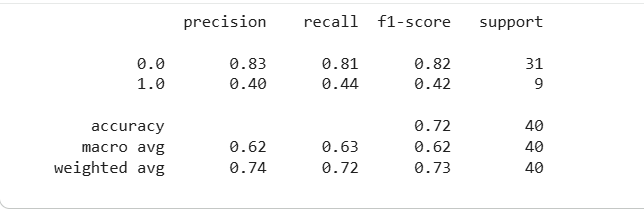

# 📊 Customer Churn Prediction

Customer Churn Prediction using Logistic Regression and Random Forest (85% Accuracy)

---

## 📌 Project Overview
This project predicts customer churn using Machine Learning classification models.

Two models were implemented:
- Logistic Regression
- Random Forest Classifier

The Random Forest model achieved **85% accuracy**, outperforming Logistic Regression (72.5%).

---

## 📂 Dataset
- Telco Customer Churn Dataset
- 200 records
- 28 features
- Target Variable: `churn`

---

## ⚙️ Technologies Used
- Python
- Pandas
- Scikit-learn
- Matplotlib
- Seaborn
- Google Colab

---

## 🧠 Models Implemented

### 1️⃣ Logistic Regression
- Accuracy: 72.5%
- Used as baseline model

### 2️⃣ Random Forest Classifier
- Accuracy: 85%
- Better performance on classification task
- Handles non-linear relationships effectively

---

## 📊 Model Evaluation
- Confusion Matrix
- Classification Report
- Accuracy Score

---

## 📊 Feature Importance

The Random Forest model was used to identify the most influential features contributing to customer churn.

Top influencing factors include:
- Tenure
- Monthly charges
- Service usage patterns
- Contract type related features

This helps businesses focus on key drivers of churn.

---

## 📈 Why Random Forest Performed Better?

- Logistic Regression assumes linear relationship between features and target.
- Random Forest handles non-linear patterns effectively.
- Random Forest reduces overfitting using multiple decision trees.
- It automatically performs feature selection during training.

---

## 🚀 Key Learnings
- Data preprocessing
- Train-test split
- Model comparison
- Performance evaluation
- GitHub project deployment

---

## 👨‍💻 Author
Deepankar  
Aspiring Data Analyst | Machine Learning Enthusiast

---

## 📸 Project Output Screenshots

### Confusion Matrix

### Logistic Regression Accuracy

### Random Forest Accuracy

---

## 🔮 Future Improvements
- Hyperparameter tuning
- Cross-validation
- Deploy model using Flask or Streamlit
- Azure ML deployment
